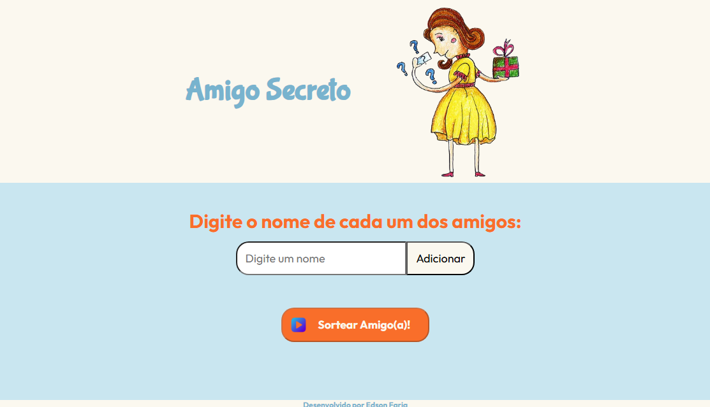

# Projeto Challenge One-Alura
# Sorteio de Amigo Secreto

Projeto para iniciantes utilizando HTML, CSS e JavaScript, para adicionar nomes de participantes num sorteio para amigo secreto.

## Funcionalidades

- Adiciona nomes à lista
- Sorteia nomes aleatoriamente
- Atribui o amigo secreto.

## Estrutura do Projeto

- Projeto a partir de noções básicas de HTML, CSS e JavaScript

